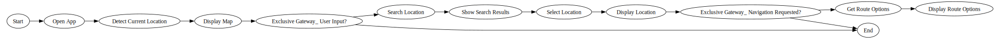

# 1. Introduction
This repository is about generating **Workflows** (graphs) from a set of **System Requirements Specification (SRS) data**. 

**What are System Requirements Specifications?**

System Requirement Specifications are detailed descriptions of what a system must or must not do. 

For example, the system requirements for the front end of the Google Maps App would include specifications such as:

1. The app should have a user-friendly interface.
2. The main screen should display a map with current location marked.
3. The app should have a search bar for inputting locations.
4. The app should provide navigation options (car, walking, biking, public transport).
5. The app should have zoom in/out functionality.
6. The app should display user’s saved places.
7. The app should provide a way to toggle between map views (satellite, terrain, normal).
8. The app should display traffic conditions.

**What is a Workflow?**

In this work, a workflow is defined as a process, which consists of several steps, with definite start and end points, where the steps of the process describe how the system operates from start to finish. 

Here is a (truncated) Workflow of how a user would use the Google Maps app:



**Assumptions**

In this work it is assumed that the System Requirements Specifications are the only source of knowledge that tell us about what the system is and how it works. However, this repository notes that this assumption is insufficient in some cases, and it may be beneficial to include additional information (like an overview of the system) to help an LLM understand what the system is about.

# 2. Overview of Approach
This work uses Generative AI and embedding models to generate Workflows from SRS data.

The main steps of the approach are:
1. **Data Preparation**: a suitable dataset must be created to evaluate the efficacy of the system. A SRS dataset is publicly available and is downloaded from [this site](https://github.com/AleksandarMitrevski/se-requirements-classification/tree/master/1-exploratory-analysis/data). This selected samples from this data set are hand-annotated so that the system can be validated by testing graphs generated by an LLM against the hand annotated set. 
2. **Generation**: By designing a suitable prompt, an LLM is used to create graphs from the SRS data. GPT3.5 Turbo is used in this repository. Although other LLMs may be used for this task, the OpenAI API is used because of its ease of use and speed. Other LLMs were not tested in this work. The focus was on creating a working solution rather than experimenting with different LLMs.
3. **Evaluation**: The graphs generated by the LLM are compared against the hand-annotations to determine the efficacy of the approach. The results are interrogated, and improvements are listed. Openai's text-embedding-ada-002 model is used for the embeddings.


# 2. Data Preparation

See `data_preparation.ipynb`.

A huge amount of effort must be spent in creating a suitable training data set for this project. Understanding what the SRS data means took at least 30% of the time in the development of this work. For this reason, the number of hand annotated samples are limited (4 Projects which is about 75 nodes; see notes on *Use of Terminology* below).

Several samples are hand annotated in this repository. In the hand annotation process crucial question arise: 'What is the purpose of a workflow?' and 'What are the characteristics of a well-defined workflow?' The answer that I came up with is that a Workflow describes how a system operates from start to finish. In other words if you look at a diagram of the workflow you should be able to fairly easily understand what the system is about from the perspective of how a user would use it. I also decided that the granularity of the Workflows should not be too granular, as this would make the diagrams too intricate and difficult to follow. However should this solution be used for serious applications, these design changes may be changed. 

In the chosen dataset, each set of SRS data is allocated to a specific project. So ProjectID 1 has a set of system requirements, Project 2 has a separate set of system requirements. The term 'ProjectID' is used extensively throughout this work to refer to a separate set of system requirements.

The style in which the data is hand-annotated is inspired by the BPMN methodology, but does not conform to any BPMN methods strictly.

Here is an example of the SRS for one of the projects:

> "All Web pages generated by the system shall be fully downloadable in no more than 10 seconds over a 40KBps modem connection. Responses to queries shall take no longer than 7 seconds to load onto the screen after the user submits the query. The system shall display confirmation messages to users within 4 seconds after the user submits information to the system. All network transactions that involve financial information or personally identifiable information shall be encrypted. Users shall be required to log in to the Cafeteria Ordering System for all operations except viewing a menu. Patrons shall log in according to the restricted computer system access policy. The system shall permit only cafeteria staff members who are on the list of authorized Menu Managers to create or edit menus. Only users who have been authorized for home access to the corporate Intranet may use the COS from non-company locations."

By reading this it is actually quite difficult to make sense of what this system is about. One needs to re-read it several times to come up with what a Workflow would look like for this data. 

This data is hand annotated as follows:
```
[['Start', 'Access System'], 
['Access System', 'View Menu'], 
['View Menu', 'Exclusive Gateway: Need to log in?'], 
['Exclusive Gateway: Need to log in?', 'User Login'],
['Exclusive Gateway: Need to log in?', 'End'], 
['User Login', 'Verify Credentials'], 
['Verify Credentials', 'Exclusive Gateway: Company network?'], 
['Exclusive Gateway: Company network?', 'Successful Login and Redirection'],
['Exclusive Gateway: Company network?', 'Home Access Authorization'], 
['Home Access Authorization', 'Exclusive Gateway: Authorized?'],
['Exclusive Gateway: Authorized?', 'Successful Login and Redirection'],
['Exclusive Gateway: Authorized?', 'End: Access Denied'],
['Successful Login and Redirection', 'Exclusive Gateway: User role?'],
['Exclusive Gateway: User role?', 'Menu Management'],
['Exclusive Gateway: User role?', 'Order Placement'],
['Menu Management', 'Save Changes'],
['Save Changes', 'Display Confirmation'],
['Display Confirmation', 'End'],
['Order Placement', 'Submit Order'],
['Submit Order', 'Encrypt Transactions'],
['Encrypt Transactions', 'Process Order'], 
['Process Order', 'Display Confirmation'],
['Display Confirmation', 'End'],
['Successful Login and Redirection', 'End'],
['Order Placement', 'End'],
['View Menu', 'End'],
['Submit Query', 'Process Query'],
['Process Query', 'Load Query Results'],
['Load Query Results', 'End'],
['Log Out', 'Ensure Secure Termination'],
['Ensure Secure Termination', 'End']]
```

This data is then easily rendered visually:


**Use of Terminology**

Each of the Workflows that are generated or hand-annotated are internally represented as *Graphs*. This is because representing a workflow as a graph is a suitable data structure to house the data and perform analytics on. Each workflow is stored as a DataFrame with 3 columns, the *ProjectID*, *from_node*, and *to_node*. By connecting each graph in its *from_node* and *to_node* then allows one to easily visualise the Workflow as a connected graph. Representing a workflow as a list of lists is further a suitable choice as this nested list structure is relatively easy for an LLM to reproduce.

# 3. Generation

See `generation.ipynb`.

Workflows are generated from SRS data by inserting the SRS data for a single project into a predetermined prompt. It may be argued that each individual requirement should be parsed by the LLM individually, however this may cause an LLM to lose context of each requirement. The prompt is designed as follows:

```
You are an expert business process consultant. 
You must come up with a workflow from the given software requirements that represents the logic of the process. 
You must respond with a list of lists, where each element of the inner list is a pair of nodes.
Do not provide any extra information.
You must use as few words as possible for each node.
Each node must represent one step in the workflow.
The steps in the graph must describe how the system works end to end.
The process must be representative of BPMN notation. 
If you create an end node, then that node should not have any children, i.e., nodes that follow it.

For example, if the requirements say: 
'All Web pages generated by the system shall be fully downloadable in no more than 10 seconds over a 40KBps 
modem connection.', 'Responses to queries shall take no longer than 7 seconds to load onto the screen after the user submits the 
query.', 'The system shall display confirmation messages to users within 4 seconds after the user submits information to
the system.', 'All network transactions that involve financial information or personally identifiable information shall be 
encrypted.', 'Users shall be required to log in to the Cafeteria Ordering System for all operations except viewing a menu.', 'Patrons shall log in according to the restricted computer system access policy.', 'The system shall permit only cafeteria staff members who are on the list of authorized Menu Managers to create or edit menus.', 'Only users who have been authorized for home access to the corporate Intranet may use the COS from non-company locations.'

Then you would respond with: 
    [["Start", "Access System"],
    ["Access System", "View Menu"],
    ["View Menu", "Exclusive Gateway: Need to log in?"],
    ["Exclusive Gateway: Need to log in?", "User Login"],
    ["Exclusive Gateway: Need to log in?", "End"],
    ["User Login", "Verify Credentials"],
    ["Verify Credentials", "Exclusive Gateway: Company network?"],
    ["Exclusive Gateway: Company network?", "Successful Login and Redirection"],
    ["Exclusive Gateway: Company network?", "Home Access Authorization"],
    ["Home Access Authorization", "Exclusive Gateway: Authorized?"],
    ["Exclusive Gateway: Authorized?", "Successful Login and Redirection"],
    ["Exclusive Gateway: Authorized?", "End: Access Denied"],
    ["Successful Login and Redirection", "Exclusive Gateway: User role?"],
    ["Exclusive Gateway: User role?", "Menu Management"],
    ["Exclusive Gateway: User role?", "Order Placement"],
    ["Menu Management", "Save Changes"],
    ["Save Changes", "Display Confirmation"],
    ["Display Confirmation", "End"],
    ["Order Placement", "Submit Order"],
    ["Submit Order", "Encrypt Transactions"],
    ["Encrypt Transactions", "Process Order"],
    ["Process Order", "Display Confirmation"],
    ["Display Confirmation", "End"],
    ["Successful Login and Redirection", "End"],
    ["Order Placement", "End"],
    ["View Menu", "End"],
    ["Submit Query", "Process Query"],
    ["Process Query", "Load Query Results"],
    ["Load Query Results", "End"],
    ["Log Out", "Ensure Secure Termination"],
    ["Ensure Secure Termination", "End"]]

Now you must write out the process for:
{requirements}
```

**Prompt Design Motivation**

The elements of the prompt are as follows:
1. What role the LLM should assume, with a description of the task that it should achieve
2. Instructions on the output format of the response
3. One-shot learning: adding one example of how to respond for a given set of SRS requirements greatly improves performance. 
4. Instruction that the LLM should now provide the graph structure for the next set of requirements.

For each of the Projects the Workflow (from_node, to_node pairs) is then generated and stored to disk.

**Note**

It is recommended not to rerun the generation script, as it will change the results slightly, due to the stochastic nature of LLMs.

# 4. Evaluation

See `evaluation.ipynb`.

The ground truth is compared against the generated data to determine the efficacy of the solution. In this work only node names are compared between the ground truth and generated nodes. 

The main evaluation metrics considered in this work are the number of True Positives, False Positives and False Negatives. A more sophisticated metric such as F1 could be used, but as a starting point these metrics are sufficient.

**Metric Explanation**

1. True Positives - A true positive is when the node is in both the ground truth data and generated data.
2. False Positives - A false positive is when a node is in the generated data but not the ground truth data.
3. False Negatives - A false negative is when a node is in the ground truth data but not the generated data.

All three of these metrics are considered as important in this work. The True Positives are a good indication of how well the system performs overall. False positives are important because it is possibly an indication of hallucinations. False negatives are important because it is an indication of how much of the information the LLM was not able to formulate into a workflow. 

**Semantic Matching**

In this work the results are compared in two cases. The first case is when we compare the ground truth nodes to the generated nodes and the nodes are only considered matches if the nodes are identical. The second case is where I use an embedding model to compare the semantic meaning of the nodes. By calculating cosine similarity of two nodes one is able to determine if nodes are conceptually matching. A similarity score of 0.8 or more is considered as matching.

The detailed findings are recorded in the `evaluation.ipynb` notebook.

# 5. Recommendations

Based on the results, the following recommendations are noted to improve the system:

1.  Some principles of 'what is a well-defined workflow' are needed to guide the annotation process. This will ensure that results are generated more consistently and match what is required by stakeholders.
2. Further training data. To better evaluate the efficacy of the system much more training data needs to be created.
3. Experimentation with different LLMs and embedding models may lead to cost and time savings.
4. The prompt can further be improved by possibly adding more examples, and adding some 'prohibitory' statements to better control the output of the LLM.
5. It would be very interesting attempt a different prompting strategy. For example, what if we broke up the SRS data and only parsed one requirement at the time? Or what if we used a multi-agent approach where one agent criticises the output of the generating agent to further improve performance.
6. The system could also be changed to more closely reflect BPMN standards.
7. The evaluation metrics do not evaluate the structure of the graph. It would be important to add some metrics to check of the structure (from-to) of the nodes in the ground truth match that of the generated graph.
